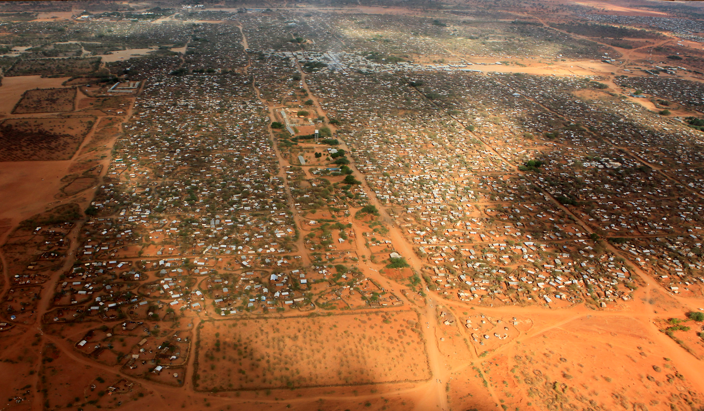

# [SSIP 2016](http://www.inf.u-szeged.hu/~ssip/2016/) - Team D
#### P#5 – Counting objects

----

Our project is *counting objects (windows, roofs)* and the original example images were taken from oblique angles and displayed really challenging subjects. On our pursuit of the ideal countable target objects Emanuela suggested to work with satellite images of informal settlements in developing countries.

One of the test images was a refugee camp in Kenya (Ifo 2 Dabaab) and an image of Kibera, one of the biggest slums of Nairobi.

## Our take on the task

### [Image Processing 101](tutorial/)

We realized that our team did not only cover 4 different nations, 4 different scientific backgrounds but also very differing levels of experiece in programming. In order make the summer school a useful experience to all of us we decided to create a Image Processing tutorial. In teams of two, we solved small tasks ranging from basic file I/O to Machine Learning in both Python and MATLAB.

### [Population Estimation in refugee camps](population_estimation/)

Densely populated urban areas in developing countries such as slums or refugee camps,  are also the most vulnerable areas to natural and manmade disasters.  This is the situation of many informal settlements in the world including our area of study: Dadaab (Ifo 2) - refugee camp. In our project we used satellite images to count the tents in order to estimate the number of Ifo 2 refugee camp population.

#### Main findings

By using simple image processing techniques we managed to estimate the size of living space in the refugee camp *Ifo 2*. By combining the results of our algorithm and other information (e.g. average household sizes of Somalis in 2014 [source](http://somalia.unfpa.org/sites/arabstates/files/pub-pdf/Population-Estimation-Survey-of-Somalia-PESS-2013-2014.pdf)) we managed to estimate the population of the total camp.

| Source | Date | Population estimation  |
|:-------|:-----------| ------: |
| Official Estimation according to [UNHCR](http://data.unhcr.org/horn-of-africa/settlement.php?id=22&country=110&region=3) | 31.05.2016 | 46.334  |
| Official Estimation according to [UNHCR](http://data.unhcr.org/horn-of-africa/settlement.php?id=22&country=110&region=3) | 30.06.2014 | 51.685 |
| Our Estimation (replace with correct number)  | 30.06.2014 | 53.029 |

### [Kibera - slum in Nairobi](slum_kibera/)

Another kind of informal settlement that at first seems to be very similar to the case of refugee camps. But narrower streets and alleys, very heterogeneous ground and roof texture and little globally useful color information made this task harder to approach.
This folder contains the results of our experiments containing machine learning segmentation and street detection with simple image processing methods.

## Who is Team D?

| Name | University | Country |
|------------------|---------------------------------|---------|
| Dominik Hirling  | University of Szeged            | Hungary |
| Marta Kiełbowicz | Poznan University of Technology | Poland  |
| Emanuela Mihut   | West University of Timisoara    | Romania |
| Asura Enkhbayar  | Medical University of Vienna    | Austria |

## License
This work is licensed under [LGPL v3](http://www.gnu.org/copyleft/lesser.html).
